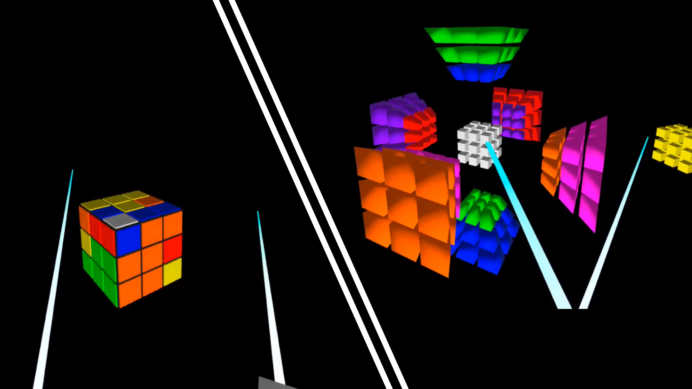
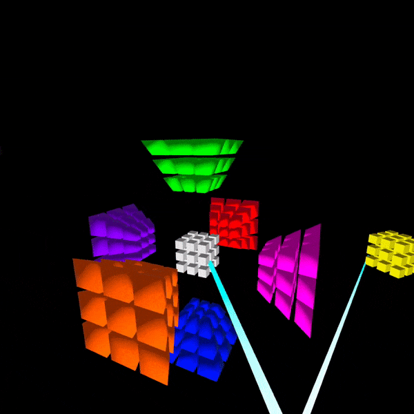
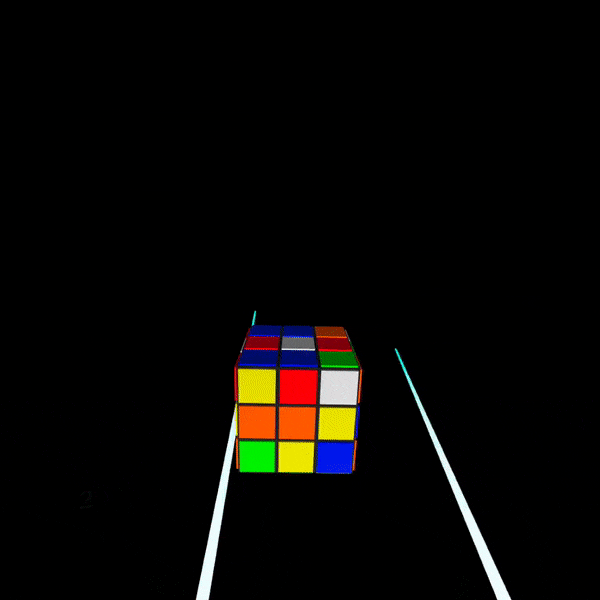

# RubiksHypercube
A virtual reality game where you can solve a Rubik's 3x3x3 cube and 3x3x3x3 hypercube.

## This project is...
a fun side project that I began when I received an Oculus Rift 2 and wanted to create a game on it. During the same time I became interested in the 4-dimensional 3x3x3x3 Rubik's hypercube and so I created a game where the player can interact with this object. Having the extra dimension in gameplay hopefully adds better comprehension with the extra 4th dimension when solving it. This game was inspired by the [Magic Cube 4D](https://superliminal.com/cube/) game with the same hypercube. In the game you can move the perspective of the cube up and down, rotate the cube, and recenter the cube. You can perform clockwise, counter-clockwise, and half turns on the cube. You can change between 3D and 4D cube, change between normal and blind mode, and change between show turns and hide turns.

## To use this project...
you can download this project and make sure that you have the proper TextMeshPro and virtual reality XR packages installed. To made edits to the program you can find the program files in the Assets/Scripts folder where I have hopefully commented the code clearly. This project also uses Mathematica to generate the cycles for the moves in the object group, and there are Mathematica notebooks in the scripts folder where you can find that information. There are many updates/bugs/fixes that can be made for this program that I don't currently have the time to do, so feel free to edit it and make changes and use or publish the changes as you wish.

